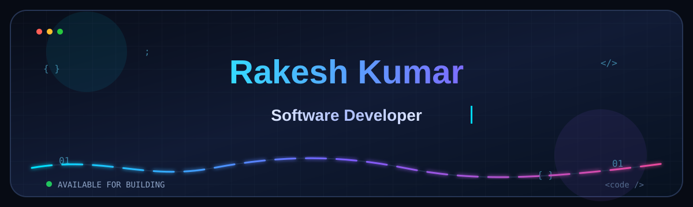
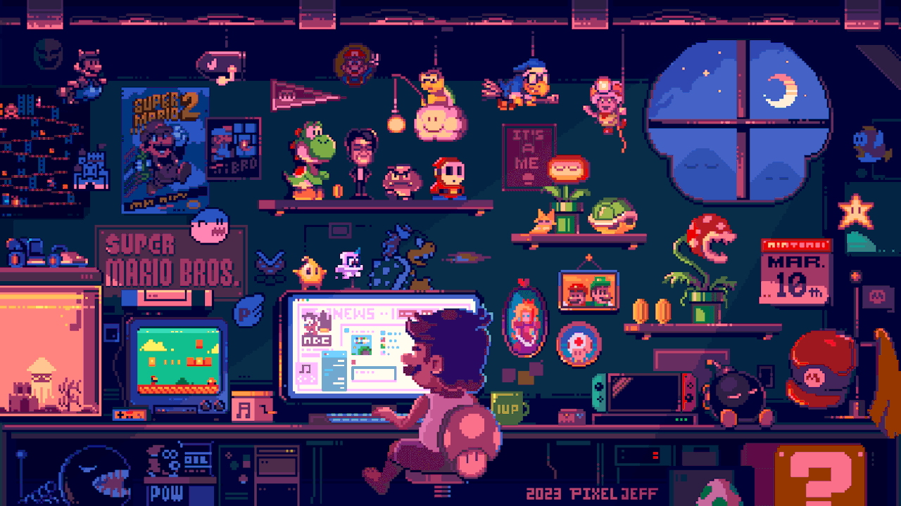

  

  

  

  

  

<h4 align="center">
  Hello Fellow &lt;Coders /&gt;! 👋
</h4>

  

  ;%E2%9A%A1+Electrical+Engineering+Major;%F0%9F%8E%93+National+Institute+of+Technology,+Rourkela;%F0%9F%92%BB+Competitive+Programmer;%F0%9F%9A%80+Software+Developer"
    alt="Typing Animation"
  />

  

<h3>💻 Technology Stack</h3>

  
  
  
  
  
  
  
  
  
  
  
  
  
  
  
  
  
  
  

  

<h3>📬 Connect With Me</h3>

  <i>
    Always open to interesting conversations, collaborations, or just a good chat!
  </i>

  

 

  

  

